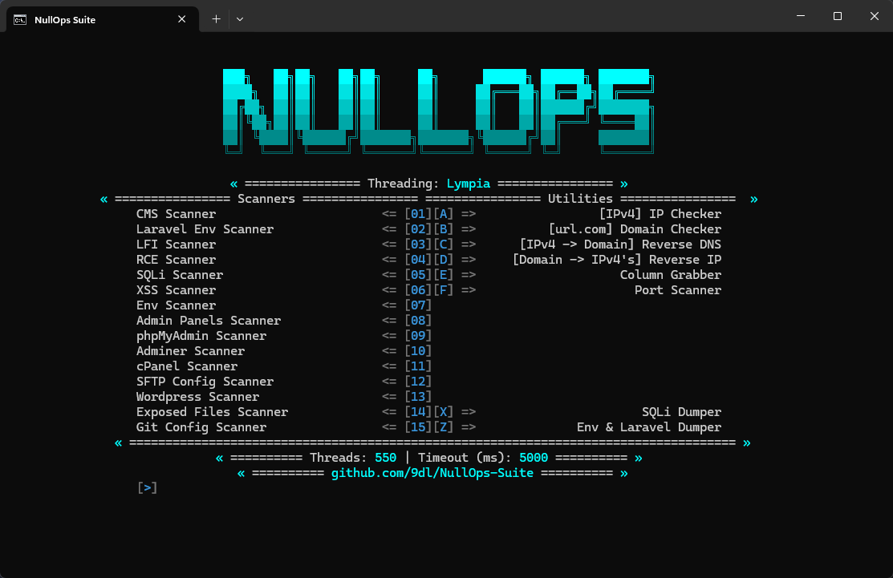

# NullOps Suite

## Overview

NullOps Suite is a multifunctional penetration testing tool developed in Go, designed to streamline the discovery and exploitation of vulnerabilities across various platforms. It features a comprehensive set of scanners and exploiters to find common vulnerabilities in web applications such as SQL Injection (SQLi), Remote Code Execution (RCE), Local File Inclusion (LFI), Cross-Site Scripting (XSS), and more.

This tool is an essential asset for security professionals, offering the ability to scan and exploit various vulnerabilities on platforms like WordPress, Adminer, Laravel, and more.

## Features

  
📂 Env & Laravel Capture

  
  - **Database**: HOST, PORT, USERNAME, PASSWORD, DATABASE
  - **SMTP**: MAILER, HOST, PORT, USERNAME, PASSWORD
  - **AWS**: ACCESS KEY ID, SECRET ACCESS KEY, DEFAULT REGION, BUCKET, URL
  - **Coinbase**: API KEY, API VERSION, WEBHOOK SECRET, WEBHOOK URI, ENABLED
  - **Stripe**: KEY, SECRET
  - **Twilio**: SID, AUTH TOKEN, VERIFY SID, VALID NUMBER
  - **Recaptcha**: SITE KEY, SECRET KEY
  - **Paypal**: CLIENT ID, CLIENT SECRET
  - **Nexmo**: KEY, SECRET
  - **Google**: CLIENT ID, CLIENT SECRET
  - **Facebook**: CLIENT ID, CLIENT SECRET
  - **Razor**: KEY, SECRET
  - **Paystack**: PUBLIC KEY, SECRET KEY
  - **Payfast**: MERCHANT ID, MERCHANT KEY
  - **Payhere**: MERCHANT ID, SECRET, CURRENCY
  - **Ngenius**: OUTLET ID, API KEY, CURRENCY
  - **Instagram**: TOKEN, CLIENT, SECRET
  - **Captcha**: SECRET KEY, SITE KEY
  - **Github**: CLIENT ID, CLIENT SECRET
  - **OpenAI**: API KEY, ORGANIZATION
  - **Klarna**: CHECKOUT TEST MODE, CHECKOUT USERNAME, CHECKOUT SECRET, CHECKOUT API VERSION
  - **Zoom**: CLIENT KEY, CLIENT SECRET
  - **Mail**: MAIL ADDRESS
  - **FTP**: HOST, USER, PORT, PASSWORD

  
🔍 Scanners

  - **Laravel Env Scanner**: Detects if the Env is Laravel and captures sensitive data.
  - **Env Scanner**: Captures sensitive environment data.
  - **Adminer Scanner**: 
      - Version Detection
      - Vulnerability Sorting
  - **WordPress Scanner**:
      - Detects if WordPress components are visitable, including:
        - **XMLRPC**
        - **WPCron**
        - **WPIncludes**
        - **WPContent**
        - **WPJSONDisabled**
        - **UserEnumerationFailed**
        - **WPLogin**
        - **WPContentUploads**
        - **VulnerablePlugins**
        - **AccessibleThemes**
        - **VulnerableJQuery**
        - **VulnerableJQueryMigrate**
        - **DashiconsCSS**
        - **AdminBarCSS**
        - **UnknownPath**
  - **Admin Panels Scanner**: Finds admin panels.
  - **CPANEL Scanner**: Finds cPanel panels.
  - **PhpMyAdmin Scanner**: Finds PhpMyAdmin login panels.
  - **SMTP Checker**: Checks if SMTP is valid (NullOps format).
  - **Stripe Checker**: Validates Stripe keys (NullOps format).
  - **Column Grabber**: Grabs columns from CSV files.
  - **Port Scanner**: Scans ports between specified start and end ports.
  - **Git Scanner**: Finds Git config files.
  - **Exposed Files Scanner**:
      - Detects site replicas (12 techniques).
      - Detects Pass DB (4 techniques).
      - Detects User DB (4 techniques).
      - Searches for zip, rar, and other exposed files.
  - **Laravel, RCE, XSS, SQLi, LFI Scanner**: Comprehensive vulnerability scanners for Laravel, RCE, XSS, SQLi, and LFI.

  
⚙️ Additional Tool Features

  - **Laravel & Env Dumper (Very Fast)**: Quickly dumps Laravel & Env databases (NullOps format).
  - **SQLi Dumper (Fast)**: Quickly injects tests and dumps databases (URLs only) using SQLMap.
  - **Threading Strategy (3x Threading)**: Implements a multithreading strategy for improved performance.
  - **Domain to IP's (Reverse IP)**: Converts domains to their corresponding IP addresses using reverse IP lookup.
  - **IP to Domain (Reverse DNS)**: Resolves IP addresses to their associated domain names using reverse DNS lookup.
  - **IP & Domain Checker**: Checks the validity and existence of IP addresses and domain names.

  
💻 CMS Scanners

  - **Supported CMS**:
    - Drupal, Craft CMS, Joomla, OpenCms, PHP-Nuke, SPIP, Sarka-SPIP, WebGUI, Laravel, Cloudflare, Akamai, Cloudfront, WordPress, vBulletin, 1C-Bitrix, a-blog cms, Concrete5, Contao, CppCMS, DNN (DotNetNuke), DTG, DataLife Engine, Django, DokuWiki, eSyndiCat, eZ Publish, FlexCMP, GetSimple CMS, Graffiti CMS, Grav, Green Valley CMS, InstantCMS, Koala Framework, Komodo CMS, Kooboo CMS, Kotisivukone, Liferay.

## Contributing

Contributions to NullOps Suite are welcome and greatly appreciated. If you'd like to contribute, please follow these steps:

1. Fork the repository.
2. Create a branch for your feature/bugfix.
3. Commit your changes.
4. Push your branch to your fork.
5. Submit a pull request.

We welcome bug fixes, new features, and improvements to enhance the functionality of the tool. Feel free to open issues for discussion or feedback.

## License

This project is licensed under the MIT License - see the [LICENSE](LICENSE) file for details.

---

Thank you for using and contributing to NullOps Suite!
